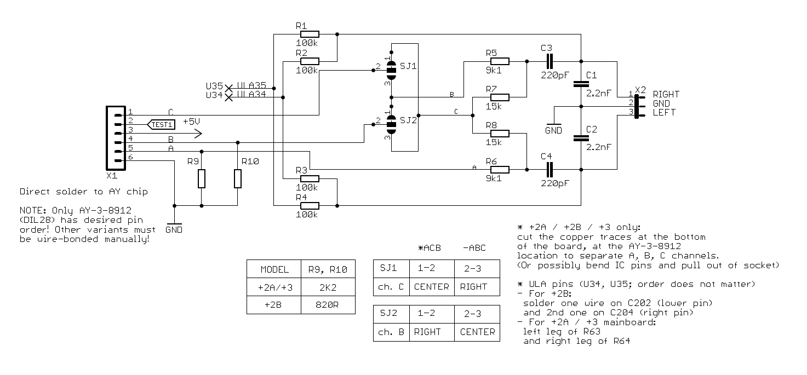
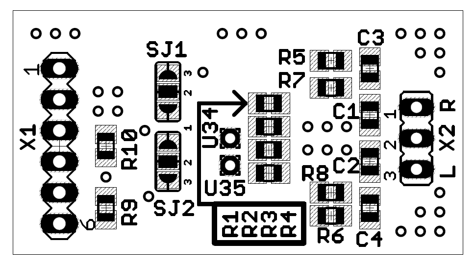

# ZX Spectrum AY Stereo
This is *yet another* but opensource design of the ACB/ABC stereo enhancement for ZX Spectrum computers. Original electrical design by Ben Versteeg / [ByteDelight.com](https://www.bytedelight.com).

There are multiple variants of the wiring in the [docs](docs/) directory but the original installation manual from ByteDelight v2014 can be found [here](docs/bd-v2014-manual.pdf).

Added option to solder the additional resistors for +2/+3 models directly on board.

## Latest version
 - gerber data generated for JLCPCB are [here](r1/gerber/)
 - schematic for *r1* is [here](r1/ay-stereo-sch.pdf)

